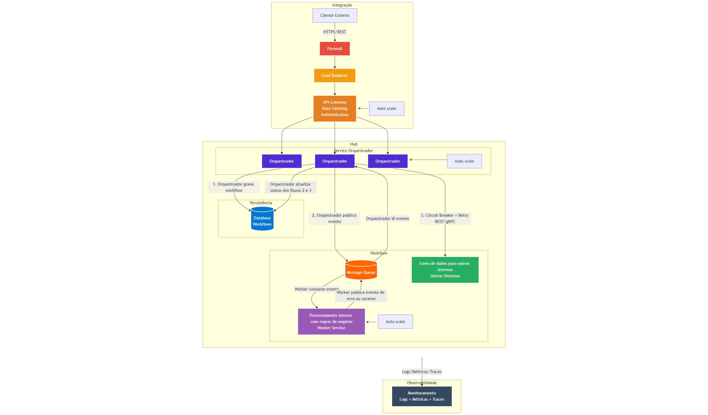

## Caso de uso

Veja [Caso de uso](/.doc/use-case.md)

# Descrição

Conforme o diagrama a seguir, ao receber uma requisição do cliente externo, é importante passar pelo firewall para maior segurança e proteção contra ataques DDos, além de controle da entrada de tráfego externo, bloqueio de IPs não autorizados e etc. 

Já o Load Balancer se encarrega de distribuir os requests entre as instâncias do API Gateway evitando o envio de solicitações para serviços sobrecarregados ou indisponíveis. O API Gateway irá atuar mais próximo da aplicação do Orquestrador, gerenciando e roteando as requisições, além de exigir autenticação e adotando estratégias de segurança como rate limiting.

O serviço do Orquestrador será responsável por atender todas as etapas do fluxo de processamento da requisição, tentando garantir alta disponibilidade através do uso de mensageria trabalhando de forma assíncrona, e com réplicas de instâncias que são escaladas por demanda e de forma automática. Além disto irá garantir a consistência das informações por meio de gravação no banco de dados dos status de todo o fluxo, e rastreabilidade gravando identificadores que possam ser monitorados. Se houver algum problema durante o processamento de alguma etapa, ele será responsável por efetuar um rollback da solicitação, chamando todos serviços para desfazer as operações.

Para comunicação com ambiente não controlado foi escolhido o uso de estratégias de circuit breaker de modo que previna falhas no uso do serviço externo, além de retry para garantir mais resiliência na aplicação. Em caso dos Orquetradores ficarem indisponíveis e for interrompido alguma etapa do fluxo, para voltar ao estado anterior pode-se adotar estratégias de idempotência para não duplicar operações e configuração de Jobs executando em background para retomar o fluxo de onde parou.

Alguns pontos de melhoria para o futuro poderiam ser abordados tendo como base as métricas dos monitoramentos dos recursos. Estes dados ajudariam na tomada de decisão para adoção de novas estratégias como: novas regiões para o cluster, réplicas de banco de dados, separação de banco de dados em escrita e leitura, e se for o caso de ter algum serviço que esteja sendo sobrecarregado com consultas, o uso de banco de dados em memória para cache pode aumentar a performance, e tornar os serviços mais disponíveis.

